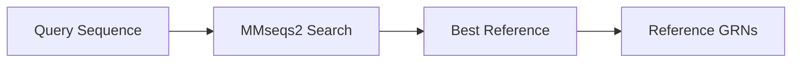
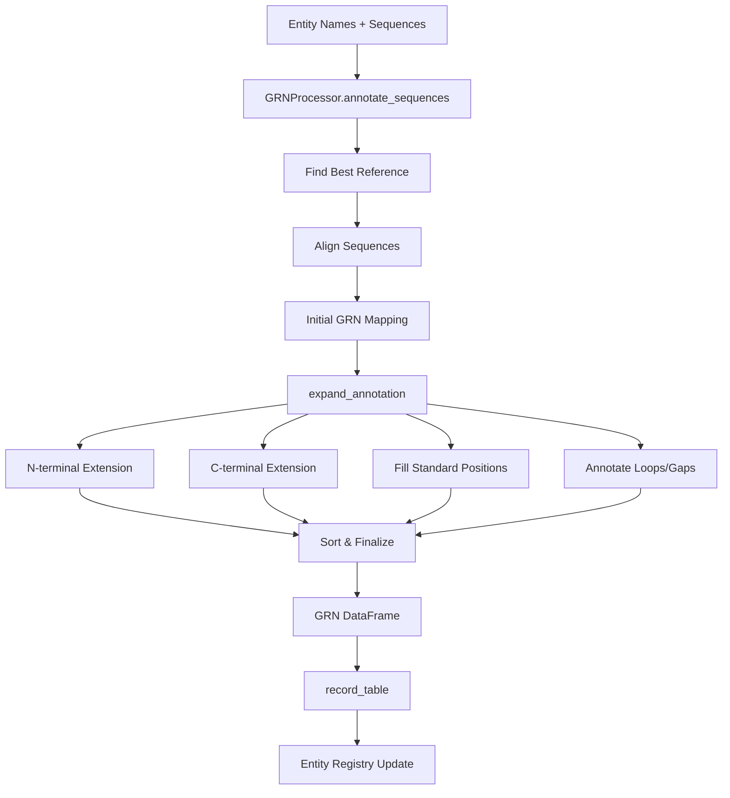

# GRN Annotation Process Documentation

## Overview

The Generic Residue Numbering (GRN) system provides a standardized position numbering scheme for protein families, enabling consistent structural and functional comparisons across homologous proteins with different sequence lengths. This document comprehensively details the entire GRN annotation process in Protos.

## Table of Contents

1. [Core Concepts](#core-concepts)
2. [Entry Points](#entry-points)
3. [Annotation Workflow](#annotation-workflow)
4. [Key Functions Reference](#key-functions-reference)
5. [Data Flow](#data-flow)
6. [Error Handling](#error-handling)
7. [Known Issues](#known-issues)

## Core Concepts

### GRN Format

GRN positions use a hierarchical numbering system:

- **Standard positions**: `"X.YY"` (e.g., "1.50", "7.53") - helix.position within helix
- **N-terminal**: `"n.XX"` (e.g., "n.10") - positions before first helix  
- **C-terminal**: `"c.XX"` (e.g., "c.05") - positions after last helix
- **Loops**: `"XY.ZZZ"` (e.g., "12.003") - between helices X and Y, distance Z from helix X

### Entity Registry Integration

**Critical**: GRN tables use entity names (not arbitrary sequence IDs) as row indices. This ensures:
- Consistent tracking across formats (structure → sequence → GRN)
- Proper relationship management in the entity registry
- Traceability from annotations back to source data

## Entry Points

### 1. High-Level API: `SequenceProcessor.annotate_with_grn()`

```python
def annotate_with_grn(
    self,
    dataset_name: Optional[str] = None,
    *,
    sequences: Optional[Dict[str, str]] = None,
    entity_names: Optional[Sequence[str]] = None,
    reference_table: str,
    protein_family: str,
    output_table: Optional[str] = None,
    materialize_entries: bool = False,
    allow_create: bool = False,
    metadata: Optional[Dict[str, Any]] = None,
    return_summary: bool = False,
) -> Union[pd.DataFrame, Tuple[pd.DataFrame, Dict[str, Any]]]
```

**Purpose**: Main entry point for GRN annotation from SequenceProcessor

**Workflow**:
1. Collects sequences from dataset/entities/explicit dict
2. Creates GRNProcessor instance
3. Calls `GRNProcessor.annotate_sequences()`
4. Records results with `GRNProcessor.record_table()`

### 2. Core Engine: `GRNProcessor.annotate_sequences()`

```python
def annotate_sequences(
    self,
    sequences: Dict[str, str],
    *,
    reference_table: str,
    protein_family: str = "gpcr_a",
    search: bool = True,
) -> Tuple[pd.DataFrame, Dict[str, Any]]
```

**Purpose**: Core annotation logic in GRNProcessor

**Workflow**:
1. Load reference GRN table
2. Create aligner and prepare reference sequences
3. For each input sequence:
   - Find best reference match
   - Project alignment to GRN positions
   - Return annotated DataFrame

### 3. Low-Level API: `annotate_grnp()`

```python
def annotate_grnp(
    grnp: GRNProcessor, 
    query_name: str, 
    query_seq: str,
    add_to_GRNP: bool = False, 
    verbose=0, 
    protein_family='microbial_opsins',
    reload=True
) -> pd.Series or pd.DataFrame
```

**Purpose**: Single sequence annotation with detailed control

**Workflow**:
1. Find best reference using MMseqs2
2. Perform initial alignment
3. Filter to strict GRN positions
4. Expand annotation to full sequence
5. Optionally add to GRN table

## Annotation Workflow

### Phase 1: Template Finding



**Key Functions**:
- `mmseqs2_align()` - Fast database search
- `msa_blosum62()` - Fallback BioPython search
- `get_seq()` - Extract reference sequence

### Phase 2: Initial Alignment

```python
# 1. Align sequences
alignment = align_blosum62(query_seq, ref_seq, aligner)

# 2. Convert alignment to initial GRN mapping
new_row = init_row_from_alignment(alignment, seq_pos2grn)

# 3. Extract correctly aligned positions
aligned_grns = get_correctly_aligned_grns(
    all_query_gene_numbers, 
    reference_grn_dict, 
    alignment
)
```

**Key Functions**:
- `align_blosum62()` - Pairwise alignment
- `init_row_from_alignment()` - Alignment → GRN mapping
- `get_correctly_aligned_grns()` - Quality filtering

### Phase 3: Annotation Expansion

The `expand_annotation()` function orchestrates the complete annotation process:

```python
def expand_annotation(
    new_row,           # Initial aligned GRNs
    query_seq,         # Full query sequence
    alignment,         # Alignment result
    max_alignment_gap=1,
    protein_family='gpcr_a',
    verbose=0
) -> Tuple[grn_list, rn_list, missing]
```

#### Step 1: N-Terminal Extension

```python
n_tail_list, first_gene_number_int = calculate_missing_ntail_grns(
    aligned_grns, 
    missing_gene_numbers, 
    grns_float_std
)
```

**Logic**:
- Find first aligned GRN position
- Calculate missing positions before it
- Assign N-terminal GRNs (n.XX format) or extend TM1

#### Step 2: C-Terminal Extension

```python
c_tail_list, last_gene_number_int = calculate_missing_ctail_grns(
    aligned_grns, 
    missing_gene_numbers, 
    query_gene_len,
    grns_float_std
)
```

**Logic**:
- Find last aligned GRN position
- Calculate missing positions after it
- Assign C-terminal GRNs (c.XX format) or extend last TM

#### Step 3: Fill Missing Standard Positions

```python
grns, missing = assign_missing_std_grns(
    missing_std_grns,      # Standard GRNs not yet assigned
    present_seq_nr_grn_list, 
    query_seq, 
    missing,               # Missing sequence positions
    grns_str_std          # All standard GRNs
)
```

**Logic**:
- Identify standard GRN positions not yet assigned
- Find best positions using pivot-based approach
- Assign based on sequence proximity

#### Step 4: Annotate Gaps and Loops

```python
nloop, gaps, cloop = annotate_gaps_and_loops(
    expanded_grn_list, 
    missing,           # Still missing positions
    query_seq, 
    grn_config_str, 
    grns_str_std
)
```

**Logic**:
- Group missing positions into intervals
- Classify as gaps (within TM) or loops (between TMs)
- Assign loop GRNs (XY.ZZZ format)

### Phase 4: Finalization

```python
# Sort GRN-residue pairs
grn_rn_pairs = sort_grn_rn_pairs(sorted_grn_list, grn_rn_pairs)

# Create final mapping
grn_list, rn_list = zip(*grn_rn_pairs)
```

## Key Functions Reference

### Assignment Functions

#### `calculate_missing_gene_numbers(all_gene_numbers, aligned_or_expanded_grns)`
- **Purpose**: Identifies residues without GRN assignments
- **Input**: All residue IDs, current assignments
- **Output**: List of missing residue numbers

#### `assign_gene_nr(seq)`
- **Purpose**: Creates residue identifiers
- **Example**: "MELK" → ["M1", "E2", "L3", "K4"]

#### `valid_jump(prev_ref_grn, curr_ref_grn, prev_query_key, curr_query_key, max_alignment_gap)`
- **Purpose**: Validates GRN assignment continuity
- **Checks**: 
  - Same TM region
  - GRN difference ≤ 0.1
  - Appropriate residue gap

### Utility Functions

#### `parse_grn_str2float(grn)`
- **Conversions**:
  - 'n.10' → -10.0
  - 'c.5' → 105.0
  - '1.50' → 1.50
  - '67.001' → 67.001

#### `normalize_grn_format(grn)`
- **Examples**:
  - '1x50' → '1.50'
  - '12.5' → '12.500'
  - Ensures 3-digit loop positions

#### `sort_grns(grn_floats)`
- **Order**: N-term → TM1 → Loop12 → TM2 → ... → C-term
- **Logic**: Numerical sort with special handling for terminals

### Configuration Management

#### `GRNConfigManager`
- **Purpose**: Protein family-specific GRN rules
- **Provides**:
  - Valid GRN intervals per TM
  - Family-specific boundaries
  - Strict vs. relaxed configurations

## Data Flow



## Error Handling

### Common Issues

1. **Empty Sequences**
   - Detected early, returns all-gap row
   - Status: "empty_sequence"

2. **Alignment Failures**
   - Falls back to BioPython if MMseqs2 fails
   - Status: "alignment_failed"

3. **No Coverage**
   - When no GRN positions can be assigned
   - Status: "no_overlap"

### Validation Steps

1. **GRN Format Validation**
   ```python
   is_valid, message = validate_grn_string(grn)
   ```

2. **Duplicate Detection**
   ```python
   is_valid, duplicates = _check_for_duplicate_grns(seq_nr_grn_list)
   ```

3. **Sequential Checking**
   ```python
   is_complete = is_sequential(rn_list)
   ```

## Known Issues

### 1. Duplicate Residue Bug

**Symptom**: Debug output shows duplicate residue assignments at the end of lists

**Location**: `expand_annotation()` function

**Debug Output**:
```
WARNING: Found 32 duplicates!
Duplicate residues: ['M1', 'K2', 'T3', ...]
Duplicates are clustered at the END of the list!
```

**Likely Cause**: Residues from the start being appended again during one of the expansion phases

### 2. MMseqs2 Path Issues

**Symptom**: "Error running MMseqs2: expected str, bytes or os.PathLike object, not NoneType"

**Cause**: MMseqs2 not installed or not in PATH

**Solution**: Falls back to BioPython alignment

### 3. Coverage Calculation

**Issue**: Coverage metrics may not accurately reflect annotation quality

**Recommendation**: Use both coverage and normalized_score for quality assessment

## Best Practices

1. **Always Use Entity Names**
   - Never use arbitrary sequence IDs
   - Ensures registry consistency

2. **Check Alignment Quality**
   - Use `normalized_score` threshold
   - Verify coverage metrics

3. **Protein Family Selection**
   - Use appropriate family config
   - Verify reference table matches family

4. **Debugging**
   - Use `verbose=2` for detailed output
   - Check intermediate results at each phase

5. **Performance**
   - Cache reference tables
   - Use MMseqs2 for large datasets
   - Consider batch processing

## Future Improvements

1. **Fix Duplicate Bug**: Investigate and fix the duplicate residue assignment issue
2. **Simplify Workflow**: Reduce number of intermediate functions
3. **Better Error Messages**: More informative failure diagnostics
4. **Performance**: Implement caching for alignments
5. **Validation**: Stricter input validation and type checking