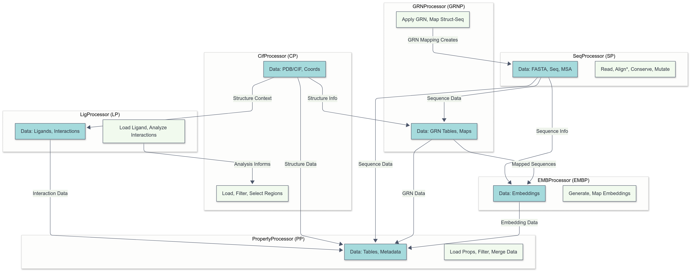
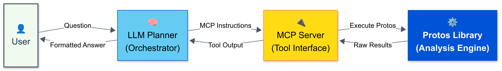

# Protos Overview

## What is Protos?

Protos is a Python library designed to streamline and standardize computational workflows for **comparative structural biology**. It originated from the need to manage, process, and analyze large datasets containing diverse protein information, including sequence, structure, alignments, properties, and standardized numbering systems.

The primary goal of Protos is to provide a **reusable and interoperable framework** that handles common, often repetitive tasks associated with analyzing multiple protein entries simultaneously. This includes:

*   Consistent data loading and saving routines.
*   Standardized handling of common bioinformatics file formats.
*   Management of file paths and datasets across different analyses.
*   Integration of various data representations (e.g., linking structural features to sequence positions).

## Core Architecture: Processors

Protos is built upon a modular architecture using distinct Python components called **'Processors'**. Each Processor is specialized for handling a specific type of data or performing a particular set of analysis tasks. Key Processors include:

*   **`CifProcessor (CP)`**: Manages 3D structural data (PDB/mmCIF files, coordinates, selections).
*   **`SeqProcessor (SP)`**: Handles protein sequence data (FASTA files, alignments, conservation, mutations).
*   **`GRNProcessor (GRNP)`**: Implements Generic Residue Numbering systems for consistent cross-structure comparison.
*   **`LigProcessor (LP)`**: Focuses on handling ligand data and analyzing protein-ligand interactions.
*   **`EMBProcessor (EMBP)`**: Deals with generating and analyzing protein embeddings.
*   **`PropertyProcessor (PP)`**: Manages associated metadata and calculated properties for proteins.

## Key Feature: Interoperability

A central design philosophy of Protos is **interoperability** between these Processors. Data is handled consistently (using standard identifiers and formats internally) so that the output from one Processor can seamlessly serve as the input for another.

This allows users to construct flexible, **multi-step analysis workflows**. For example, one can identify residues in a binding pocket using `CifProcessor`, map these residues to a standard numbering scheme with `GRNProcessor`, analyze their conservation across an alignment using `SeqProcessor`, and store associated properties with `PropertyProcessor`.

The relationships and primary data flow between these core processors are visualized below:


*(Diagram showing connections between CP, SP, GRNP, LP, EMBP, and PP)*

## Current Status & Protos-MCP Context

Protos provides a functional foundation for performing these complex analyses programmatically using Python. However, its direct use requires scripting skills. The **Protos-MCP project** (described elsewhere in this application/documentation) aims to build upon this existing Protos foundation by creating an interface layer using Large Language Models (LLMs) and the Model Context Protocol (MCP). This will make the powerful, interoperable capabilities of Protos accessible to a broader range of researchers through natural language interaction, without requiring direct Python programming.


## Accessing Protos via Natural Language: The Protos-MCP Concept

While Protos provides a powerful Python framework for structural bioinformatics (as described above), its practical origin and design lead to specific usability challenges.

**1. Protos' Origin and the Accessibility Gap:**

Protos wasn't designed top-down to solve a single problem; it emerged organically from repeatedly performing common structural bioinformatics workflows across different protein families. These workflows typically involved downloading data, creating datasets, loading structures/sequences, performing alignments, filtering data based on specific criteria, calculating properties, and visualizing results. Performing such multi-step processes once is manageable via custom scripts, but repetition demands efficiency. Protos was created by consolidating these recurring helper functions and processing steps into a reusable library.

However, this origin also highlights its primary adoption barrier. Experienced bioinformaticians, faced with a specific task, might find it equally or more efficient to write a targeted script rather than learning and integrating the general Protos framework. Conversely, the researchers who could most benefit from automating these repetitive, multi-step analyses – bench biologists working directly with structural data – typically lack the required Python programming expertise to use Protos at all. Consequently, Protos, while functional, remains inaccessible to a large portion of its potential user base.

**2. The Vision: Conversational Structural Bioinformatics:**

Computational analysis is fundamental to modern structural biology. Imagine the efficiency gains if routine (yet currently complex) computational tasks could be requested simply:

*   "Can you get me the structure for PDB ID 7ZOU?"
*   "Align this downloaded structure (7ZOU) to my AlphaFold prediction for protein X."
*   "Which residues show the largest C-alpha deviation between these two aligned structures?"
*   "Does the deviation in that loop correlate with the AlphaFold pLDDT confidence score?"

These seem like straightforward questions, but answering them requires navigating data formats, running specific tools, parsing outputs, and integrating results – tasks that constitute the "pain" of bioinformatics data processing. Protos contains the logic to perform these underlying steps, but lacks an accessible interface.

**3. Protos-MCP: Connecting Protos to AI via MCP:**

To bridge this gap and realize the vision of conversational bioinformatics, we propose **Protos-MCP**. This system integrates Protos with Artificial Intelligence (AI), specifically Large Language Models (LLMs), using the **Model Context Protocol (MCP)**.

*   **What is MCP?** MCP is a standardized communication protocol designed specifically to allow LLMs (like ChatGPT, Claude) to securely and reliably interact with external software. It provides a defined way for an application (like Protos) to advertise its capabilities as specific **'Tools'** (functions the LLM can ask the application to run) and data access points as **'Resources'**. The LLM can understand these definitions and request their execution.

*   **The Protos-MCP Workflow:** We will implement an **MCP Server** that acts as a controller wrapping the Protos library. Key Protos functions will be exposed as MCP 'Tools'. When a user asks the LLM a question:
    1.  The LLM interprets the request and plans which Protos 'Tools' are needed.
    2.  The LLM sends standardized instructions via MCP to the Protos MCP Server.
    3.  The MCP Server securely executes the requested Protos functions using the underlying library.
    4.  Protos returns the results to the MCP Server.
    5.  The Server sends the results back to the LLM in a standard format.
    6.  The LLM formulates a user-friendly answer.

This allows users to leverage Protos' integrated capabilities for multi-step analyses simply by describing their goals in natural language. The interaction flow is visualized below:


*(Diagram showing User -> LLM -> MCP Server -> Protos Library -> MCP Server -> LLM -> User)*

By combining the existing analytical power of Protos with the accessibility offered by LLMs via the standardized MCP interface, Protos-MCP aims to make sophisticated structural bioinformatics workflows available to everyone. The following examples demonstrate the types of workflows this system could enable.


# Protos-MCP Example Workflows

Computational analysis is increasingly vital for structural biology, enabling insights from large datasets. The Protos Python library provides a foundational framework for these analyses, integrating data handling (sequences, structures, alignments) and core processing steps through interoperable modules ('Processors'). Protos allows complex, multi-step workflows to be constructed programmatically. However, this requires Python scripting and familiarity with the library, limiting its direct use by many researchers.

This project proposes **Protos-MCP**, which aims to bridge this gap by integrating Protos with Large Language Models (LLMs) via the Model Context Protocol (MCP). The goal is to expose Protos' capabilities as MCP 'Tools', allowing LLMs to orchestrate complex analyses based on user requests in natural language.

The following examples illustrate how users might interact with the proposed Protos-MCP system. For each example, we show:
1.  The user's natural language request.
2.  A conceptual plan the LLM might formulate.
3.  **Illustrative Python code snippets** showing how the same task could currently be achieved *programmatically* using existing or planned Protos functionalities. This highlights the steps Protos handles and the complexity Protos-MCP aims to abstract.
4.  The implementation goal: wrapping these Protos functions as MCP Tools.
5.  The expected user outcome via Protos-MCP.

*(Note: While Protos provides the foundation, some specific functions or integration points shown in the code snippets might require refinement or further implementation as part of creating robust MCP tools).*

---

### Example 1: Simple Data Fetching

**Goal:** Retrieve standard data from common bioinformatics databases using natural language.

**User Request (Natural Language):**
> "Get me the PDB structure for 7ZOU and the protein sequence for human Rhodopsin from UniProt (ID P08100)."

**Conceptual LLM Plan:**
1.  Identify PDB ID: `7ZOU`.
2.  Identify UniProt ID: `P08100`.
3.  Plan to execute: (a) Fetch PDB structure, (b) Fetch UniProt sequence.

**Current Protos Programmatic Approach (Illustrative Code):**
```python
# Assumes processor instances are initialized
# from protos.processing.structure.struct_processor import CifProcessor
# from protos.processing.sequence.seq_processor import SeqProcessor # Assuming SeqProcessor handles UniProt fetch
# cp = CifProcessor()
# sp = SeqProcessor()

# Fetch and load PDB structure (downloads if not found locally)
try:
    # cp.load_structure('7ZOU') # Method would handle fetch/load logic
    print(f"Structure 7ZOU loaded/downloaded.") # Placeholder confirmation
except FileNotFoundError:
    print(f"Error: Could not find or download PDB 7ZOU.")

# Fetch UniProt sequence
try:
    # Assuming fetch_uniprot_sequence returns the sequence string or adds it internally
    # rhodopsin_seq = sp.fetch_uniprot_sequence('P08100') # Placeholder method
    rhodopsin_seq = "MNGTEGPNFYVPFSNKTGVVRSPFEAPQYYLAEPWQFSMLAAYMFLLIMLGFPINFLTLYVTVQHKKLRTPLNYILLNLAVADLFMVFGGFTTTLYTSLHGYFVFGPTGCNLEGFFATLGGEIALWSLVVLAIERYVVVCKPMSNFRFGENHAIMGVAFTWVMALACAAPPLVGWSRYIPEGMQCSCGIDYYTPHEETNNESFVIYMFVVHFIIPLIVIFFCYGQLVFTVKEAAAQQQESATTQKAEKEVTRMVIIMVIAFLICWLPYAGVAFYIFTHQGSDFGPIFMTIPAFFAKTSAVYNPVIYIMMNKQFRNCMVTTLCCGKNPLGDDEASTTVSKTETSQVAPA" # Example sequence
    if rhodopsin_seq:
        print(f"Sequence for P08100 fetched:\n{rhodopsin_seq[:60]}...")
    # Or if it loads internally:
    # sp.load_sequences_from_uniprot(['P08100'])
    # print(f"Sequence for P08100 loaded into SeqProcessor.")
except Exception as e:
    print(f"Error fetching UniProt sequence P08100: {e}")

# Results are now available programmatically within cp.data or sp.sequences
Use code with caution.
Markdown
Proposed Protos-MCP Implementation (TODO):
Create an MCP Tool (e.g., fetch_rcsb_structure) that calls the underlying Protos method for fetching PDB files.
Create an MCP Tool (e.g., fetch_uniprot_sequence) that calls the underlying Protos method for fetching sequences.
The LLM orchestrates calling these Tools via the MCP server based on the user request.
Expected Outcome (via Protos-MCP):
The system confirms file download/retrieval and provides the requested sequence or file location info directly to the user.
Example 2: Medium - GRN Mapping & Sequence Conservation
Goal: Link structural positions (via GRN) to sequence conservation using natural language.
User Request (Natural Language):
"For structure 6CMO chain A, which residues correspond to GPCRdb positions 3.50, 6.48, and 7.39? Also, how conserved are these positions in a Class A GPCR alignment?"
Conceptual LLM Plan:
Load structure 6CMO.
Get sequence of chain A.
Assign GPCRdb GRNs to sequence.
Map specific GRNs to 6CMO_A residues.
Load relevant Class A GPCR alignment.
Calculate conservation for target GRNs in alignment.
Present results.
Current Protos Programmatic Approach (Illustrative Code):
# Assumes processor instances are initialized
# from protos.processing.structure.struct_processor import CifProcessor
# from protos.processing.grn.grn_processor import GRNProcessor
# from protos.processing.sequence.seq_processor import SeqProcessor
# cp = CifProcessor()
# grnp = GRNProcessor()
# sp = SeqProcessor()

try:
    # 1 & 2: Load structure and get sequence
    # cp.load_structure('6CMO') # Assumes structure file exists or is fetched
    # seq_A = cp.get_sequence('6CMO', 'A') # Assumes method extracts sequence from loaded structure data

    # Placeholder sequence for example continuity
    seq_A = "MNGTEGPNFYVPFSNKTGVVRSPFEAPQYYLAEPWQFSMLAAYMFLLIMLGFPINFLTLYVTVQHKKLRTPLNYILLNLAVADLFMVFGGFTTTLYTSLHGYFVFGPTGCNLEGFFATLGGEIALWSLVVLAIERYVVVCKPMSNFRFGENHAIMGVAFTWVMALACAAPPLVGWSRYIPEGMQCSCGIDYYTPHEETNNESFVIYMFVVHFIIPLIVIFFCYGQLVFTVKEAAAQQQESATTQKAEKEVTRMVIIMVIAFLICWLPYAGVAFYIFTHQGSDFGPIFMTIPAFFAKTSAVYNPVIYIMMNKQFRNCMVTTLCCGKNPLGDDEASTTVSKTETSQVAPA"

    # 3: Assign GRNs
    # Assumes assign_grns_to_sequence returns a mapping or updates grnp instance
    # grn_map_info = grnp.assign_grns_to_sequence(seq_A, pdb_id='6CMO_A', grn_scheme='GPCRdb_A') # Actual GRN assignment logic

    # 4: Map specific GRNs (using placeholder results)
    target_grns = ['3.50', '6.48', '7.39']
    # residue_mapping = grnp.get_residues_from_grns(target_grns, protein_id='6CMO_A') # Requires method to use stored map
    residue_mapping = {'3.50': 'K296', '6.48': 'W265', '7.39': 'Y306'} # Example result
    print(f"Residue Mapping for 6CMO_A: {residue_mapping}")

    # 5: Load Alignment (assuming pre-computed and GRN-aligned)
    # Depending on implementation, this might be via SeqProcessor or GRNProcessor
    # alignment_loaded = sp.load_alignment('ClassA_GPCRs_GRNaligned.fasta') # Assumes method exists
    # or grnp.load_grn_table('ClassA_GPCRs_GRNaligned.csv')
    alignment_loaded = True # Placeholder status

    # 6: Calculate Conservation (using placeholder results)
    if alignment_loaded:
        # conservation_scores = sp.calculate_conservation(target_grns, position_type='GRN') # Assumes method exists
        conservation_scores = {'3.50': 0.98, '6.48': 0.85, '7.39': 0.70} # Example result
        print(f"Conservation Scores: {conservation_scores}")
    else:
        print("Alignment could not be loaded.")

except Exception as e:
    print(f"An error occurred: {e}")
Use code with caution.
Python
Proposed Protos-MCP Implementation (TODO):
Create MCP Tools corresponding to each required Protos method (e.g., load_structure, get_sequence, assign_grn, get_residues_from_grns, load_alignment, calculate_conservation).
The LLM orchestrates the sequence of Tool calls via the MCP server.
Expected Outcome (via Protos-MCP):
The system directly provides the user with the residue mapping and conservation scores.
Example 3: Advanced - Multi-Structure Pocket Analysis with Alignment & Ranking
Goal: Perform a complex, multi-step comparative analysis via natural language.
User Request (Natural Language):
"Align structures 6CMO, 7ZOU, and 5XEZ. For each, find residues within 4Å of the ligand RET. Map these pocket residues to GPCRdb GRNs. Then, in each aligned structure, calculate the average distance between the C-alpha of residue 3.50 and the C-alphas of all identified binding pocket residues. Rank the structures by this average distance."
Conceptual LLM Plan:
Load structures.
Align structures.
Loop through each structure:
a. Identify pocket residues near RET.
b. Assign GRNs.
c. Map pocket residues to GRNs.
d. Get coordinates for GRN 3.50 and pocket GRNs (using alignment context).
e. Calculate average distance.
f. Store result.
Rank results.
Present ranked list.
Current Protos Programmatic Approach (Illustrative Code):
import numpy as np
# Assumes processor instances are initialized
# from protos.processing.structure.struct_processor import CifProcessor
# from protos.processing.grn.grn_processor import GRNProcessor
# Assume alignment functions/wrappers exist within Protos (e.g., in CifProcessor or separate module)
# cp = CifProcessor()
# grnp = GRNProcessor()

pdb_ids = ['6CMO', '7ZOU', '5XEZ']
ligand_id = 'RET'
distance_cutoff = 4.0
anchor_grn = '3.50'
grn_scheme = 'GPCRdb_A'
results = {}

# Placeholder data structures and functions for demonstration
# Real implementation would use pandas DataFrames, BioPython structures, etc.
mock_structures = {
    '6CMO': {'seq': 'SEQ_A_6CMO...', 'atoms': {'A:K296': [1.0, 2.0, 3.0], 'A:W265': [4.0, 5.0, 6.0], 'A:Y306': [7.0, 8.0, 9.0], 'A:L111': [10.0, 11.0, 12.0]}}, # Example coords
    '7ZOU': {'seq': 'SEQ_A_7ZOU...', 'atoms': {'A:K296': [1.1, 2.1, 3.1], 'A:W265': [4.1, 5.1, 6.1], 'A:Y306': [7.1, 8.1, 9.1], 'A:M111': [10.1, 11.1, 12.1]}},
    '5XEZ': {'seq': 'SEQ_A_5XEZ...', 'atoms': {'A:K296': [1.2, 2.2, 3.2], 'A:W265': [4.2, 5.2, 6.2], 'A:Y306': [7.2, 8.2, 9.2], 'A:I111': [10.2, 11.2, 12.2]}}
}
mock_grn_maps = { # ProteinID -> {GRN -> ResID}
    '6CMO': {'3.50': 'A:K296', '6.48': 'A:W265', '7.39': 'A:Y306', '3.33': 'A:L111'},
    '7ZOU': {'3.50': 'A:K296', '6.48': 'A:W265', '7.39': 'A:Y306', '3.33': 'A:M111'},
    '5XEZ': {'3.50': 'A:K296', '6.48': 'A:W265', '7.39': 'A:Y306', '3.33': 'A:I111'}
}
mock_pockets = { # ProteinID -> List[ResID]
    '6CMO': ['A:K296', 'A:W265', 'A:L111'],
    '7ZOU': ['A:K296', 'A:W265', 'A:M111'],
    '5XEZ': ['A:K296', 'A:W265', 'A:I111']
}

def get_mock_coord(pdb_id, res_id):
    # Placeholder: Simulates getting CA coord; needs alignment context in real version
    return np.array(mock_structures[pdb_id]['atoms'].get(res_id, [0,0,0]))

try:
    # 1. Load structures (Simulated: data assumed loaded into mock_structures)
    print("Structures loaded (simulated).")

    # 2. Align structures (Simulated: assume alignment done, coords are comparable)
    # alignment_info = cp.align_structures(pdb_ids, method='Cealign') # Actual call
    print("Structures aligned (simulated).")
    alignment_info = "mock_alignment" # Placeholder

    # 3. Loop through structures
    for pdb_id in pdb_ids:
        # 3a. Identify pocket residues (Simulated)
        # pocket_residues = cp.extract_binding_pocket(pdb_id, ligand=ligand_id, distance=distance_cutoff)
        pocket_residues = mock_pockets[pdb_id]

        # 3b & 3c. Assign GRNs and Map pocket residues (Simulated)
        # seq = cp.get_sequence(pdb_id)
        # grn_map_info = grnp.assign_grns_to_sequence(seq, pdb_id=pdb_id, grn_scheme=grn_scheme)
        # pocket_grns = grnp.get_grns_from_residues(pocket_residues, protein_id=pdb_id)
        grn_map = mock_grn_maps[pdb_id]
        pocket_grns = [grn for grn, res_id in grn_map.items() if res_id in pocket_residues]

        # 3d & 3e. Get relevant coordinates (C-alphas, using alignment context) (Simulated)
        # coord_350 = cp.get_ca_coordinate(pdb_id, identifier_type='GRN', identifier_value=anchor_grn, alignment_info=alignment_info)
        # pocket_coords = cp.get_ca_coordinates_for_list(pdb_id, identifier_type='GRN', identifier_list=pocket_grns, alignment_info=alignment_info)
        res_id_350 = grn_map.get(anchor_grn)
        coord_350 = get_mock_coord(pdb_id, res_id_350) if res_id_350 else None

        pocket_coords = []
        for grn in pocket_grns:
            res_id = grn_map.get(grn)
            if res_id:
                coord = get_mock_coord(pdb_id, res_id)
                pocket_coords.append(coord)

        # 3f & 3g. Calculate average distance
        if coord_350 is not None and pocket_coords:
            distances = [np.linalg.norm(coord_350 - p_coord) for p_coord in pocket_coords]
            avg_dist = np.mean(distances) if distances else float('inf')
            results[pdb_id] = avg_dist
            print(f"Processed {pdb_id}, Avg Dist: {avg_dist:.2f} Å")
        else:
            print(f"Could not calculate distance for {pdb_id} (missing coords?).")
            results[pdb_id] = float('inf') # Assign infinite distance if calculation failed


    # 4 & 5. Rank results
    ranked_results = sorted(results.items(), key=lambda item: item[1])
    print("\nRanked Structures by Average Distance:")
    for pdb, dist in ranked_results:
        dist_str = f"{dist:.2f} Å" if dist != float('inf') else "N/A"
        print(f"- {pdb}: {dist_str}")

except Exception as e:
    print(f"An error occurred during the workflow: {e}")
Use code with caution.
Python
Proposed Protos-MCP Implementation (TODO):
Create MCP Tools for each complex step: load_structures, align_structures, extract_binding_pocket, assign_grn, get_grns_from_residues, get_ca_coordinate (handling alignment), get_ca_coordinates_for_list (handling alignment), potentially a dedicated calculate_average_distance tool or have the LLM request raw coordinates and perform calculation itself.
The LLM manages the loop and orchestrates the sequence of Tool calls via the MCP server.
Expected Outcome (via Protos-MCP):
The system returns the final ranked list of structures based on the calculated average distance, directly answering the user's complex comparative question.