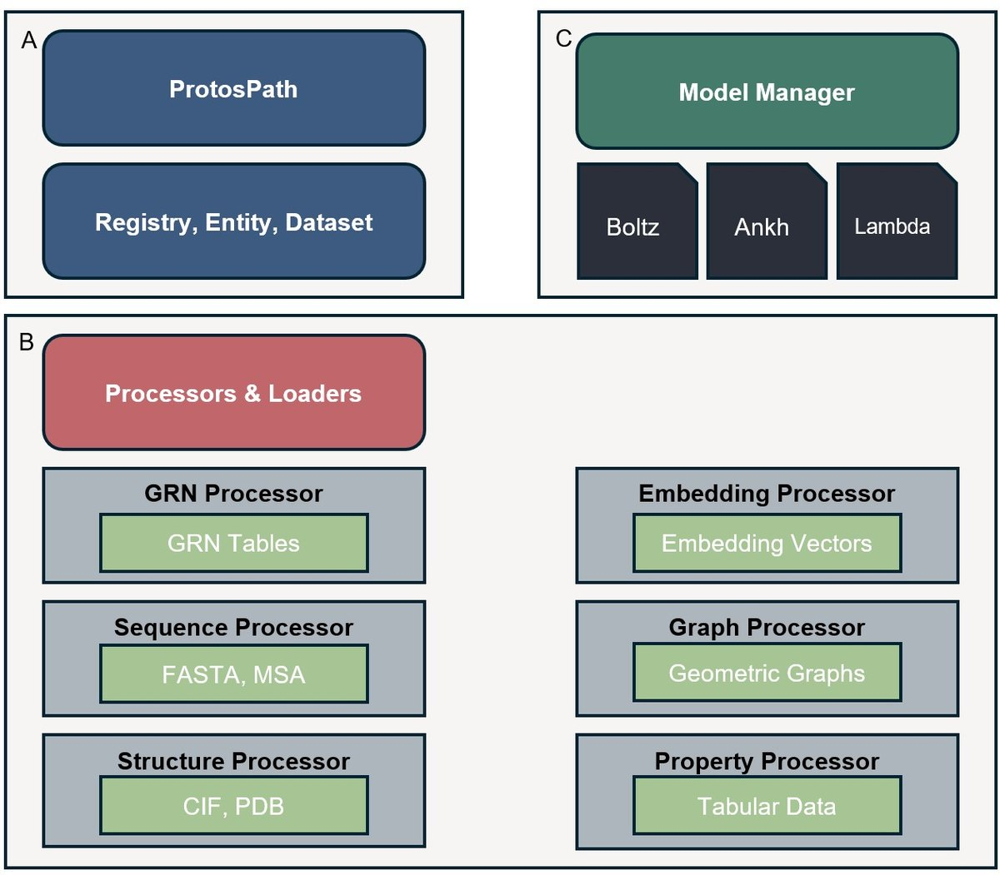

<h1 align="center">ProtOS</h1>

<p align="center">
  <b>A zero-configuration Python framework for structural biology.</b><br>
  Structures, sequences, GRNs, properties, and ML embeddings — every piece of data is a named entity in one registry.
</p>

<p align="center"></p>

<p align="center">
  <a href="https://flurinh.github.io/aboutme">◆ Portfolio</a> &nbsp;·&nbsp;
  <b>The build:</b>
  <a href="https://github.com/flurinh/LM-DTA">LM-DTA</a> →
  <a href="https://github.com/flurinh/mt">Master thesis</a> →
  <b>ProtOS</b> →
  <a href="https://github.com/flurinh/MOGRN">MOGRN</a> →
  <a href="https://github.com/flurinh/lambda">Lambda</a> →
  <a href="https://github.com/flurinh/Protos_MCP">ProtOS-MCP</a>
</p>

---

## What it is

ProtOS handles structural-biology data the way a good toolkit should: you work with
**human-readable names** (`1ubq`, `EGFR_HUMAN`) and the framework manages every file path,
format conversion, and dataset behind the scenes. A modular **processor** handles each data
type, a central **registry** tracks everything, **datasets** group entities for batch work,
and a **Model Manager** dispatches jobs to ML backends (Boltz, Ankh, Lambda).

It's the analysis engine the rest of my PhD work is built on.

## Quick start

```bash
git clone https://github.com/flurinh/protos.git
cd protos
pip install -e .
pip install -e ".[embedding]"   # optional: protein-LM embeddings
```

```python
import protos
from protos.processing.structure import StructureProcessor

sp = StructureProcessor()

# Load any structure by name — RCSB, AlphaFold, or a local file
rho = sp.load_entity("1u19")                      # bovine rhodopsin

# Group entities once, operate on the whole set
sp.create_dataset("opsins", ["1u19", "6fk6", "1c3w"])
structures = sp.load_dataset("opsins")
```

Structures, sequences, GRNs, embeddings — all one tracked registry.

## Core ideas

- **Zero configuration** — set a data path once (or use the default); never touch a file path again.
- **Entity registry** — every structure / sequence / property / embedding is an entity with a name, linkable across formats.
- **Datasets** — named collections for batch operations across any processor.
- **Processors** — Structure, Sequence, GRN, Embedding, Graph, and Property, each with its own loaders.
- **Model Manager** — submit and track ML jobs (structure prediction, embeddings, property prediction).

## What it powers

| Project | What it adds |
|---------|--------------|
| **[MOGRN](https://github.com/flurinh/MOGRN)** | a generic residue numbering for type-I opsins, built on the GRN processor |
| **[Lambda](https://github.com/flurinh/lambda)** | a model that predicts opsin absorption (λmax), registered as a Model-Manager backend |
| **[ProtOS-MCP](https://github.com/flurinh/Protos_MCP)** | exposes the whole toolkit to LLM agents over the Model Context Protocol |

More detail lives in [`docs/`](docs/) — unified data access, the entity registry, zero-configuration design, and the Model Manager.

---

<p align="center">
◀ <b>Previously:</b> <a href="https://github.com/flurinh/mt">Master thesis — GPCRs as graphs</a>
&nbsp;·&nbsp;
<b>Next:</b> <a href="https://github.com/flurinh/MOGRN">MOGRN — one numbering for every opsin</a> ▶
</p>
