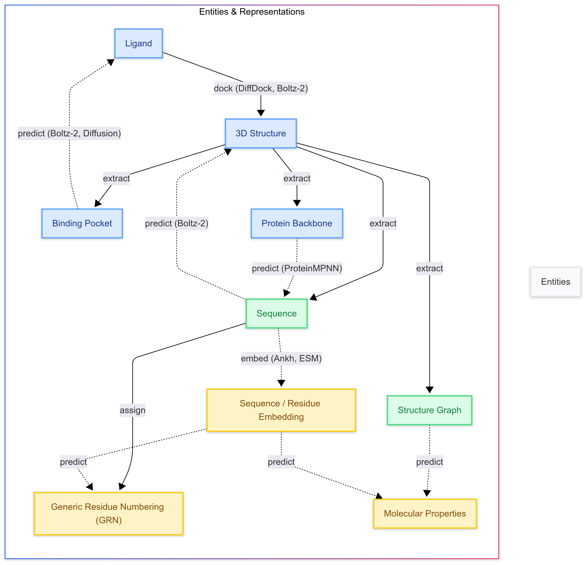

# Protos Overview


## What is Protos?

Protos is a Python library designed to **standardize and execute complex computational workflows** essential for structural biology research. It provides integrated capabilities for handling diverse biological data types – including sequences, 3D structures, alignments, and associated properties – through a unified framework.

The core function of Protos is to manage multi-step analyses by breaking them down into defined tasks handled by modular components.

## 🔧 Installation

### Prerequisites

- **Python 3.10+** is required
- **CUDA 11.8** (only for GPU installation)
- **Conda** (recommended for environment management)

### ✅ Minimal Installation (CPU-only)

This installs only the core Protos functionality without GPU acceleration or AI models:

```bash
pip install -e .
```

This is sufficient for:
- Structure processing (PDB/mmCIF files)
- Sequence analysis and alignments
- GRN (Generic Residue Numbering) operations
- Basic property calculations

### 🚀 GPU Installation with AI Capabilities

For GPU acceleration and AI features (protein embeddings, graph neural networks):

```bash
# 1. Create a fresh conda environment
conda create -n protos python=3.10 -y
conda activate protos

# 2. Install CUDA runtime (required for GPU support)
conda install -c nvidia cuda-runtime=11.8.0

# 3. Install PyTorch with CUDA 11.8 support
pip install torch==2.6.0 torchvision --index-url https://download.pytorch.org/whl/cu118


# 4. Install PyTorch Geometric (for graph neural networks)
pip install pyg_lib torch_scatter torch_sparse torch_cluster torch_spline_conv -f https://data.pyg.org/whl/torch-2.6.0+cu118.html
pip install torch_geometric

# 5. Install Protos with GPU extras
pip install -e ".[gpu]"
```

This enables:
- **EmbeddingProcessor**: Generate protein embeddings using ESM-2, Ankh models
- **GPU-accelerated computations**: Faster processing for large datasets
- **Graph neural networks**: PyTorch Geometric support for structure-based ML
- **Multi-GPU support**: Via the accelerate library

## Recent Updates (2025-06-25)

- **GRN Notation**: Now uses dot notation (e.g., `1.50`) as standard; x notation (e.g., `1x50`) is deprecated
- **New Features**: Added GRN-Structure integration methods to CifBaseProcessor
- **Bug Fixes**: Fixed path resolution, sequence extraction, and data type compatibility issues
- **Testing**: Added comprehensive real-data tests for GRN and structure processors

## Core Architecture: Processors & Interoperability

Protos utilizes a modular architecture built upon distinct Python components called **'Processors'**. Each Processor is specialized for a specific domain, such as:

*   **`CifBaseProcessor`**: Manages 3D structure data
*   **`SeqProcessor`**: Handles sequence data and alignments
*   **`GRNBaseProcessor`**: Implements Generic Residue Numbering systems
*   **`LigProcessor`**: Deals with ligand information and interactions
*   **`EMBProcessor`**: Manages protein embeddings
*   **`PropertyProcessor`**: Integrates metadata and calculated properties

A key feature is the **interoperability** between these Processors. Outputs from one (e.g., selected residues from `CifBaseProcessor`) can directly serve as inputs for another (e.g., for GRN mapping by `GRNBaseProcessor`, followed by sequence analysis by `SeqProcessor`), enabling flexible construction of sophisticated analysis pipelines.

The relationships and primary data flow between these core processors are visualized below:


*(Diagram showing how protein entities and their data interact and are processed)*

## 🔑 Entity System: Universal Biological Entity Management

### Overview

Protos implements a **Universal Entity System** that provides a unified way to track and manage biological entities across different data formats. This system is critical for maintaining data consistency and enabling seamless cross-format workflows.

### Core Concept: One Entity, Multiple Formats

The entity system ensures that the same biological entity (e.g., a protein) maintains a consistent identity across all its representations:

```python
# Same protein "P12345" across different formats
"P12345" → entity_id "a3f2d8c91b"
  ├── sequence format: /sequence/fasta/P12345.fasta
  ├── structure format: /structure/mmcif/AF-P12345-F1.cif  
  ├── GRN format: in table with entity_id column
  └── embedding format: /embedding/esm2_embeddings/a3f2d8c91b.pkl
```

### Key Features

1. **Automatic Entity Resolution**: Users work with familiar biological names (PDB IDs, UniProt IDs, etc.) while the system manages hash-based entity IDs internally.

2. **Cross-Format Tracking**: When a protein sequence is used to predict a structure, both formats are linked to the same entity ID.

3. **Metadata Independence**: Each format can have its own metadata while sharing the same entity identity.

4. **Multi-Entity Tables**: GRN tables are special - they contain multiple entities (one per row) with an entity_id column.

### Entity Interactions in Workflows

The entity system enables powerful cross-format workflows:

```python
# Example: Sequence → Structure → GRN → Analysis workflow
from protos.processing.sequence.seq_processor import SeqProcessor
from protos.processing.structure.struct_base_processor import CifBaseProcessor
from protos.processing.grn.grn_base_processor import GRNBaseProcessor

# 1. Load a sequence (automatically registered as entity)
seq_proc = SeqProcessor(name="analysis")
sequence = seq_proc.load_sequence_entity("P12345")  # Uses biological name

# 2. After AlphaFold prediction, load the structure
# The system knows this is the same entity
struct_proc = CifBaseProcessor(name="analysis")
structure = struct_proc.load_structure("AF-P12345-F1")  # Same entity!

# 3. Assign GRNs to the sequence
grn_proc = GRNBaseProcessor(name="analysis")
grn_assignment = grn_proc.assign_grns(
    sequence=sequence,
    protein_id="P12345"  # Still using biological name
)

# 4. All processors understand they're working with the same entity
entity_id = generate_entity_id("P12345")  # "a3f2d8c91b"
# All formats are tracked under this single entity ID
```

### Entity Registry Architecture

The system uses a global `EntityRegistry` that:
- Maintains entity ID mappings (biological name ↔ hash ID)
- Tracks which formats exist for each entity
- Stores format-specific metadata
- Enables entity discovery across the system

### Best Practices

1. **Always use biological names** when interacting with processors:
   ```python
   # ✅ Good - use biological names
   processor.load_structure("1ABC")
   
   # ❌ Bad - don't use hash IDs directly
   processor.load_structure("a3f2d8c91b")
   ```

2. **Let the system handle entity registration**:
   ```python
   # Processors automatically register entities when loading/saving
   seq_proc.save_sequence_entity("MY_PROTEIN", sequence)  # Auto-registered
   ```

3. **Use entity IDs for cross-format linking**:
   ```python
   # When implementing custom workflows
   entity_id = generate_entity_id("MY_PROTEIN")
   # Use this ID to link data across formats
   ```

### Special Case: GRN Tables

GRN tables are unique because they contain multiple entities:

```python
# GRN table with entity_id column
grn_proc.save_grn_table("my_analysis", include_entity_ids=True)

# Results in CSV with structure:
# entity_id    | 1.50 | 2.50 | 3.50 | ...
# a3f2d8c91b   | M    | K    | L    | ...  (Entity 1)
# b4e7f2a93c   | M    | A    | V    | ...  (Entity 2)
```

This design allows tracking of individual sequences within larger analyses while maintaining entity consistency.

### External Dependencies

Protos integrates with several external bioinformatics tools:

- **MMseqs2**: For sequence searching and clustering
- **GTalign**: For GPU-accelerated protein structure alignment
- **Boltz-2**: For protein structure prediction
These tools need to be installed separately and made available in your system PATH.
