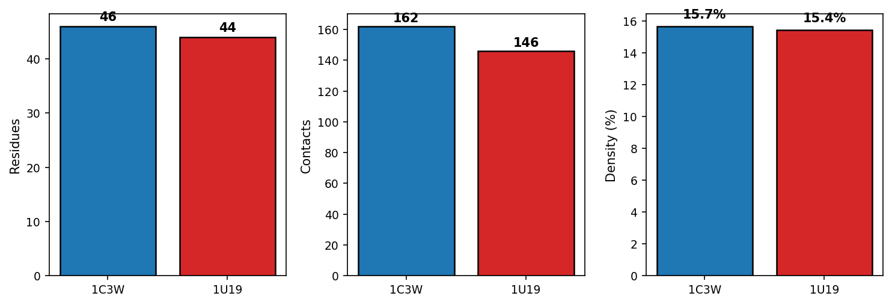

ProtOS
ProtOS was not planned. Over three years of research, I accumulated scripts for parsing structures, fetching sequences, reconciling identifiers, and extracting binding pocket features. The same problems appeared in every analysis, solved each time with slightly different code. The majority of my time went not to data management — parsing inconsistent file formats, reconciling identifiers across databases, and writing disposable scripts to connect tools that were never designed to work together. Biological data files are messy in ways that the word "data" does not convey. Structures for example come as e.g., .pdb, .cif, .pdbqt, or .sdf — all human-readable text formats designed for a researcher inspecting one structure at a time, not for programmatic analysis across thousands of proteins. Annotations are often inconsistent between databases. Metadata written by researchers can be unreliable. I gathered everything into one package, generalized the interfaces, and ensured the pieces worked together. What started as manual data curation became the foundation on which every subsequent contribution in this thesis ultimately relies— and, through a natural language interface described in Chapter 6, a tool that makes protein data accessible to researchers who cannot write code.
The underlying problem is not unique to this thesis. Understanding what determines an opsin's spectral properties requires more than one kind of data. Sequence comparison reveals which residues evolution has conserved — but global sequence similarity is a poor predictor of λmax, because absorption depends on the local environment of the binding pocket, not the full chain. Structure shows where binding pocket residues sit relative to the chromophore — but of the thousands of known opsin sequences, fewer than 70 have unique experimental structures. A measured λmax tells you how a protein absorbs light — but the measurement sits in a paper, disconnected from the sequence in UniProt and the structure in the PDB. No single data type answers the question of what determines spectral tuning. Answering it requires integrating all three — and doing so across thousands of proteins.
The practical barrier is that these data types live apart. Sequences in UniProt, structures in the PDB, predictions in AlphaFold DB, measurements scattered across decades of publications. Bacteriorhodopsin alone carries three identifiers — P02945, 1C3W, AF-P02945-F1 — one per database, none linking to the others. Tools like Biopython or the Schrödinger suite handle tasks dealing with a single protein well, but chaining them into reproducible multi-modal workflows means writing custom scripts that parse, convert, and reconcile at every step.
ProtOS is a Python package built around a single organizing principle: all protein data lives under one path. Setting the ProtOS path defines a strict directory structure — sequences, structures, embeddings, properties, each in a predictable location — with no configuration required. A protein added to ProtOS exists in one place, and every processor knows where to find it. Every data object — a sequence, a structure, an embedding, a measured property — enters the system as an entity: a named record with tracked identity that persists across sessions. A structure loaded from the PDB, a sequence fetched from UniProt, and a λmax value entered from a paper all attach to the same protein and stay attached as analysis proceeds. Six processors handle the data types this work requires: sequences, structures, residue contact graphs, standardized positions, embeddings, and properties. Each manages one modality. Outputs from one become inputs to another — through recorded relationships, not file naming conventions or researcher memory (Figure 2.1).
*![Figure 2.1: ProtOS architecture overview. (A) ProtosPath and the Entity system provide persistent identity and organization. (B) Processors handle specific data modalities: GRN Processor for standardized positions, Sequence Processor for FASTA and alignments, Structure Processor for coordinates, Embedding Processor for pLM representations, Graph Processor for contact networks, and Property Processor for tabular data. (C) The Model Manager orchestrates external compute for structure prediction (Boltz), embeddings (pLM), and spectral prediction.](data/thesis_overview_protos_v1.png)*
The following sections introduce each processor through the analysis that produced the Type II opsin dataset used throughout this thesis. Each section presents a processor, then demonstrates it on opsin data. By the end of the chapter, the framework handles sequences, structures, pocket graphs, standardized positional labels, language model embeddings, and protein annotations — and can connect any combination of these for a given protein.
Sequence Processor
Sequence identity is an unreliable predictor of molecular function. Two cone opsins can share 80% identity and absorb light 140 nm apart, because spectral tuning depends on a few pocket residues, not the whole chain. Sequence is the starting point, not the answer. Understanding what it reveals — and where it stops — requires combining sequence data with structural and functional information. Doing so at scale means managing thousands of sequences from UniProt, NCBI, and organism-specific repositories, each with different identifiers and curation standards.
The Sequence Processor manages retrieval, registration, and the analytical operations that follow. It routes requests to UniProt or NCBI based on identifier format, downloads sequences, and registers each in ProtOS. Registered sequences become the substrate for homology search (BLAST against remote databases, MMseqs2 for local high-throughput clustering), pairwise and multiple sequence alignment through BioPython, per-position conservation analysis, residue covariation via mutual information, and combinatorial mutant library generation at specified positions.
seq_proc = SequenceProcessor()
SequenceLoader(processor=seq_proc).download_and_register("uniprot:P02699", name="RHO_BOVIN")
ncbi = NCBILoader(processor=seq_proc)
hits = ncbi.blast_search(sequence=seq_proc.load_entity("RHO_BOVIN"), database="swissprot")
ncbi.download_batch(accessions, dataset_name="opsin_atlas")

Building the Type II opsin dataset required collecting sequences across all known animal opsin subfamilies. Starting from nine query sequences — one per subfamily, spanning rod opsins, cone opsins (MWS and SWS), melanopsin, neuropsin, encephalopsin, RGR, peropsin, and parapinopsin — I used iterative BLAST searches against UniProt to retrieve homologs at increasing distance thresholds. Redundancy filtering and subfamily assignment via phylogenetic placement produced a dataset of 27,640 sequences across 13 subfamilies.
Figure 2.2 shows the sequence identity distributions for the nine subfamilies with query references. Rod opsins (n = 10,285) form a tight distribution centered around 70% identity to the bovine rhodopsin query. Cone MWS opsins (n = 4,982) and cone SWS opsins (n = 3,237) show broader diversity, with identities extending below 40%. Non-visual opsins — melanopsin (n = 1,581), neuropsin (n = 920), encephalopsin (n = 644) — form smaller clusters. Each subfamily is internally cohesive while well-separated from others, validating the classification used throughout this thesis.

**

These 27,640 sequences are now registered in ProtOS. Each carries its accession, subfamily assignment, and species — and each is available to every subsequent processor.
Structure Processor
A single mutation can reposition a side chain in the binding pocket without changing the overall fold. The sequence looks nearly identical. The absorption spectrum shifts by 40 nm. Structure reveals why: the mutated residue now sits closer to retinal, altering the electrostatic environment around the conjugated chain. Conversely, two proteins with no detectable sequence homology — bacteriorhodopsin and bovine rhodopsin — bind the same chromophore through geometrically equivalent pockets. Convergent evolution produced the same spatial solution twice. No sequence alignment will find this relationship. Structural superposition on the ligand will.
Structural data is sparse. The PDB holds roughly 200,000 experimental structures for hundreds of millions of known sequences. AlphaFold DB fills the coverage gap through prediction, but predicted structures lack ligands, waters, and ions — the features that define a binding site. And the coordinate files themselves — PDB and mmCIF formats designed for archival deposition — must be parsed into representations where spatial relationships become queryable before any analysis can begin.
The Structure Processor parses coordinate files into queryable representations where atoms, residues, and their contacts are programmatically accessible. Each structure is registered in ProtOS. Relationships to sequences arise explicitly — when a sequence is extracted from a structure, or when Boltz2 predicts a structure from a sequence, the provenance is recorded. The processor identifies ligand contacts (including water-mediated and ion-mediated contacts), filters structures by chain or residue range, applies coordinate transformations and Kabsch superpositions, and merges multiple structures into multi-chain complexes.
struct_proc = StructureProcessor()
StructureLoader(processor=struct_proc).download_batch(["1C3W", "1U19"], dataset_name="opsin_structures")
contacts = struct_proc.get_ligand_interactions("1C3W", ligand_id="RET", chain_id="A", cutoff=4.0)

Bacteriorhodopsin (PDB 1C3W, Type I) and bovine rhodopsin (PDB 1U19, Type II) illustrate what structural comparison reveals. Extracting residues within 4 Å of retinal yields 19 pocket residues in bacteriorhodopsin, 22 in bovine rhodopsin. Both pockets span helices 3 through 7, with the counterion (D85 in bacteriorhodopsin, E113 in bovine rhodopsin) positioned to stabilize the protonated Schiff base. Kabsch alignment on retinal atoms places the two chromophores in the same frame: the pockets overlap around the Schiff base and counterion and diverge elsewhere. Global structural alignment fails because the helix topologies differ; alignment on the ligand succeeds because both proteins face the same physical constraint — binding retinal in a manner that permits isomerization and spectral tuning.

**

Both structures are now in ProtOS, each with extracted pocket residues and ligand contacts. The binding pocket residues form spatial contact networks — representing these as graphs makes the topology explicit and comparable.
Graph Processor
Residue 85 and residue 212 in bacteriorhodopsin are 127 positions apart in sequence. In the folded protein, they sit on opposite sides of the retinal pocket, both contacting the chromophore. The sequence says they are distant. The structure says they are neighbors. A graph says both: nodes for residues, edges for spatial proximity, the relationship explicit.
Residue contact graphs formalize binding pocket topology. Nodes represent residues. Edges connect pairs whose Cα atoms fall within a distance threshold, typically 6–8 Å. The resulting network captures three-dimensional proximity independent of sequence numbering — directly comparable across proteins with different sequences, different folds, or no detectable homology. For machine learning, graphs are natural inputs: graph neural networks operate on nodes and edges, so a pocket graph becomes a direct bridge between structural coordinates and predictive models.
The Graph Processor generates these graphs from any structure already in ProtOS, optionally restricting to residues near a specified ligand to isolate binding pockets or active sites. The resulting graph is stored and linked to its source structure.
graph_proc = GraphProcessor(default_cutoff=6.0, default_level="residue")
graph_name = graph_proc.generate_graph(
    "1U19", chain="A", near_hetatm=("RET", 7.0), cutoff=6.0
)
graph_data = graph_proc.load_entity(graph_name)

Graphs can be generated at atom or residue level, individually or in batch across an entire structure dataset. Nodes can be selected by GRN position rather than residue number, producing graphs where every node carries a transferable label — comparable across proteins regardless of sequence numbering. Conversion to PyTorch Geometric tensors is built in, so that a pocket graph extracted here becomes a direct input to a graph neural network.
Extracting binding pocket graphs from both bacteriorhodopsin and bovine rhodopsin tests whether pocket topology is comparable across families. Both graphs use residues within 9 Å of retinal as nodes and Cα–Cα distances below 4 Å as edges. Both pockets produce graphs of comparable size, demonstrating that the representation works across folds despite independent evolutionary origins.

**

These graphs are already associated with their source sequences and structures. Combining them with a cross-family numbering scheme assigns every node a transferable positional label — residue 85 in bacteriorhodopsin and residue 113 in bovine rhodopsin both become position 3.28, the counterion.
GRN Processor
Every protein sequence and structure uses its own residue numbering — position 85 in one protein has no defined relationship to position 85 in another. This is not a data format problem but a biological one: insertions and deletions accumulated differently in each lineage, so functionally equivalent positions carry different numbers across homologs. Databases like GPCRdb address this by maintaining curated reference tables that map sequence positions to a family-wide coordinate system.
Generic Residue Numbering (GRN) defines such a coordinate system anchored to conserved structural features. For seven-transmembrane proteins, the Ballesteros-Weinstein convention numbers each helix 1 through 7, designating the most conserved residue on each helix as X.50. Position 3.50 is the anchor on helix 3; positions 3.49 and 3.51 are its immediate neighbors. GRN position 3.28 refers to the same structural location in any GPCR, regardless of sequence length or insertion history. The GRN Processor manages these reference tables and annotates query sequences by aligning them to the references — no structure is needed for the query itself.
grn_table, summary = seq_proc.annotate_with_grn(
    dataset_name="opsin_atlas",
    reference_table="gpcrdb_ref",
    protein_family="gpcr_a",
    output_table="atlas_grn",
    return_summary=True,
)
grn_proc = GRNProcessor()
table = grn_proc.load_table("atlas_grn")

Once annotated, GRN positions propagate across modalities. The Graph Processor can select nodes by GRN label rather than residue number, producing cross-family comparable graphs. The Structure Processor can annotate coordinates with positional identity. The Sequence Processor can generate mutant libraries at specific GRN positions rather than arbitrary sequence indices.
Animal opsins are GPCRs, so Ballesteros-Weinstein numbering applies. The nine query opsins — rod opsin (B. taurus), cone MWS and cone SWS (H. sapiens), parapinopsin (I. punctatus), encephalopsin, melanopsin, neuropsin, peropsin, and RGR (all H. sapiens) — span the evolutionary breadth of Type II opsins. I annotated these nine sequences at 18 functionally important GRN positions to reveal which positions are conserved and which vary between subfamilies.
Figure 2.5a shows the resulting alignment table. The 18 positions fall into three functional categories. Conserved anchors maintain the helical scaffold: N at 1.50 and D at 2.50 coordinate a water-mediated hydrogen bond network between TM1 and TM2, while W at 4.50 stabilizes the helix bundle. Spectral tuning sites surround the chromophore: position 3.28 is the counterion (E in visual opsins, shifting to D or other residues in non-visual subfamilies), and position 3.32 varies between A, S, and T — small residues with different hydrogen-bonding capabilities that modulate the electrostatic environment around retinal. Activation microswitches form the signal transduction relay: E/DRY at 3.49–3.51 (ionic lock), PIF at 3.40 and 5.50 (inter-helix connector), CWxP at 6.47–6.50 (TM6 toggle switch), NPxxY at 7.49–7.53 (G protein coupling), and the Schiff base lysine at 7.43 — absolutely conserved because every opsin requires it to bind retinal.
One departure stands out. Cone SWS opsin has glycine at position 2.50 instead of the canonical aspartate. This is confirmed across 3,237 SWS1 subfamily members in the dataset (52% G, 38% N, 8% D), indicating evolutionary loss of the sodium coordination site in this UV/blue-sensitive lineage — consistent with the known absence of sodium sensitivity in short-wavelength opsins.

**

Figure 2.5b maps all 18 positions onto bovine rhodopsin (PDB 1U19). The microswitches form a connected relay from the extracellular retinal-binding site through the transmembrane core to the cytoplasmic G protein interface. The physical connection between light absorption and cellular response traces through these positions.

**

Type I opsins are not GPCRs and Ballesteros-Weinstein does not apply. MOGRN, described in Chapter 3, fills this gap by establishing a structure-based numbering system for microbial rhodopsins anchored to the retinal-binding site. GRN positions are sparse and curated — 18 positions per sequence. Dense per-residue features, capturing patterns across entire sequences, complement them.
Embedding Processor
Protein language models (pLMs) such as ESM-2 and Ankh are neural networks trained on millions of protein sequences. They learn which amino acids co-occur, which substitutions are tolerated, and which positions are constrained — producing dense numerical representations called embeddings. The Embedding Processor wraps model inference, stores the resulting tensors as protein-linked datasets, and provides the pooling and extraction operations needed for downstream use.
emb_proc = EmbeddingProcessor(model_name="ankh_large")
embeddings = emb_proc.embed_sequences(
    sequences,
    embedding_type="per_residue",
    save_dataset="opsin_atlas__ankh_large"
)

Ankh Large produces a 1536-dimensional vector for each residue in the sequence — for a 300-residue protein, a matrix of 300 × 1536. Averaging across residues yields a single 1536-dimensional vector summarizing the whole protein. The per-residue matrix provides node features on contact graphs, where each node gets its own embedding. The mean-pooled vector enables similarity searches and clustering across the full dataset. The Embedding Processor supports ESM-2 and Ankh model families across multiple dimensionalities, with per-residue and mean-pooled embedding types. For large-scale work, streaming to disk avoids memory constraints — the 27,639 embeddings occupy ~160 MB as a cached matrix.
I embedded all 27,639 sequences with Ankh Large. Mean-pooling across sequence length yields one vector per protein. UMAP projection into two dimensions (Figure 2.6) reveals the structure of opsin embedding space without supervision — the model received no subfamily labels, spectral measurements, or structural information during training.
Subfamilies cluster. The nine query sequences, marked as stars, sit within their respective subfamily clouds. These clusters emerge without supervision — the model received no subfamily labels during training.

**

Every protein in the dataset now carries a sequence, GRN annotations, and an embedding. What remains is linking these to the measurements and classifications that describe each protein's biology.
Property Processor
Every protein carries associated values — numbers, labels, categories that describe what is known about it. The Property Processor stores any such tabular data in CSV tables keyed to entity identifiers. A row might hold a measured λmax from a spectroscopy paper, a subfamily classification, a species name, or an experimental condition. New columns can be added as a project progresses. When LAMBDA returns a predicted λmax, that prediction enters the same table alongside the experimental measurement — queryable in the same way, linked to the same protein.
prop_proc = PropertyProcessor()
prop_proc.record_properties(
    "atlas_properties", rows,
    allow_create=True, materialize_entries=True,
)
table = prop_proc.load_table("atlas_properties")

The property table links each of the 27,640 sequences to its subfamily, sequence identity to the query, sequence length, and species. For the approximately 1,800 opsins with published absorption spectra — assembled from decades of spectroscopy across both Type I and Type II families — the property table stores measured λmax. The 27,640 sequences have embeddings and GRN annotations, but fewer than 7% have measured absorption data. This sparse coverage — rich annotations, limited measurements — is characteristic of protein science and illustrates why linking modalities matters.
Model Manager
Structural biology increasingly depends on machine learning models — structure prediction (AlphaFold2, Boltz2), protein design (RFdiffusion, LigandMPNN), fitness prediction, binding affinity estimation, and spectral property prediction. Each model expects specific input formats and produces different output formats. New models appear regularly, and without a consistent interface, adopting each one means writing bespoke preprocessing and postprocessing code.
The Model Manager treats models as configurable components. Each model is described by its expected inputs and outputs, and the manager translates between processor outputs and model-specific formats. Adding a new model requires only this input/output specification; the data management infrastructure that ProtOS already provides handles the rest.
from protos.models import ModelManager
manager = ModelManager()
inv = manager.prepare("boltz2", inputs={"sequence": seq, "name": "design_01"})
result = manager.run_and_ingest(inv)

The prepare call packages processor outputs into the format Boltz2 expects; run_and_ingest executes the job and registers the returned structure in ProtOS. The same pattern applies to any model: spectral prediction, backbone generation with RFdiffusion2, sequence design with LigandMPNN, or embedding computation at scale. Results re-enter ProtOS as properties or new data modalities, available to every processor.
At this point, each protein in the dataset may carry a sequence, GRN annotations at 18 positions, per-residue Ankh Large embeddings, and — where structures exist — binding pocket graphs. The property table makes this multi-modal representation queryable: filter by subfamily, select proteins with measured λmax, retrieve their pocket graphs and embeddings. Any combination can serve as input to a model. When a model returns predictions, those predictions enter the same table alongside the measurements — queryable in the same way, linked to the same proteins.
Discussion
This chapter introduced ProtOS through an analysis of Type II opsins. Starting from nine query sequences, I assembled a dataset of 27,640 proteins, extracted binding pocket residues from experimental structures, built residue contact graphs, annotated standardized positions, computed language model embeddings, and linked measured absorption spectra — each modality associated with the proteins it describes, each accessible to every subsequent step.
These representations provide the infrastructure for the research contributions that follow. Chapter 3 introduces MOGRN, a standardized numbering system for microbial rhodopsins, validated against 129 structures assembled and aligned through ProtOS. Chapter 4 presents LAMBDA, a cross-family spectral prediction model whose training data — pocket graphs, per-residue embeddings, GRN annotations, and measured λmax values — was built entirely through the processors described here. The Opsin Atlas extends those predictions to 47,700 sequences, a scale made practical because ProtOS manages the pipeline from sequence retrieval through spectral prediction.
The framework has technical boundaries. Database coverage includes UniProt, PDB, AlphaFold DB, and NCBI; additional sources require new loaders. GRN annotation requires a numbering system for the family of interest — GPCRs have Ballesteros-Weinstein, microbial rhodopsins now have MOGRN, but other families cannot use the GRN Processor until such systems are developed.
More fundamental is the barrier of programming. ProtOS requires Python. This excludes experimental scientists who generate the data that computational tools analyze — crystallographers, spectroscopists, biochemists who understand protein function but have never written a for-loop. An experimentalist who asks "which residues contact retinal in this structure?" understands what they want; they cannot get it without a programmer. ProtOS-MCP, described in Chapter 6, addresses this through natural language access.
